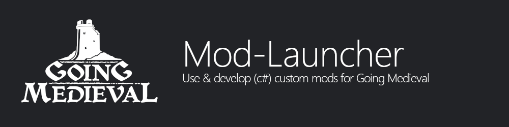
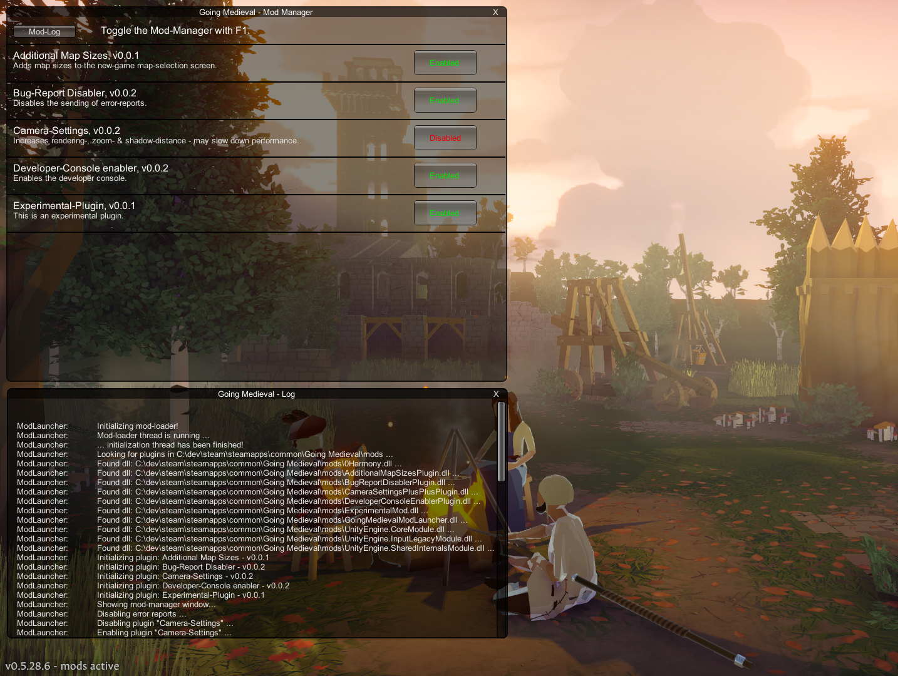
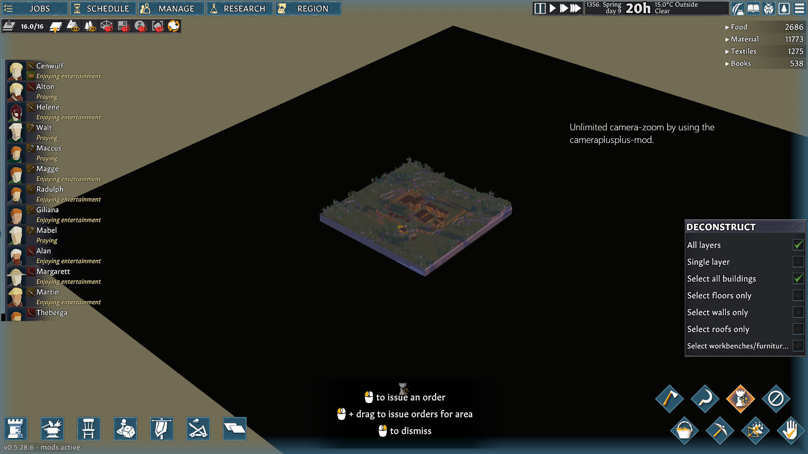

  

# Going Medieval - Mod Loader & Plugin-API
This project allows the development and loading of mods for Going Medieval.

**Note** \
This project allows the modification of the gm runtime - this can lead to unexpected behaviour, errors or bugs. 
Be aware of this - **I don't take any responsibility for any damage or corrupted files** - you are on your own now 🐱‍👤.

Going Medieval is a product of the game development studio [Foxy Voxel](https://foxyvoxel.io/). All rights belong to them.
This project uses [Harmony](https://harmony.pardeike.net/) and [Unity-Doorstop](https://github.com/NeighTools/UnityDoorstop). 

## Features
The following features are supported by the Mod Launcher:
- Current support for version 0.5.28.6
- Load C# based mods using a simple [Plugin-API](https://github.com/benjaminfoo/GoingMedievalModLauncher/blob/main/GoingMedievalModLauncher/src/plugins/IPlugin.cs)
- Access the native unity API / runtime
- Replace / patch methods by using [Harmony](https://harmony.pardeike.net/)
- No manual editing of files
- Mod-Manager User Interface for enabling / disabling a mod  
- Logging
 - ModLauncher / Plugin related logging within the 'mod_launcher.log' file
 - Unity related logging within the 'output_log' file

### Mods
The following mods are realized by using the Plugin-API\

[Additional Map Sizes - Plugin](https://github.com/benjaminfoo/GoingMedievalModLauncher/tree/main/AdditionalMapSizesPlugin)\
A simple mod which adds different map sizes to the new game - map size dropdown.

[BugReport Disabler - Plugin](https://github.com/benjaminfoo/GoingMedievalModLauncher/tree/main/BugReportDisablerPlugin)\
Disables the bug-reporting feature & ui so there are no error-popups while experimenting.

[CameraSettings++ - Plugin](https://github.com/benjaminfoo/GoingMedievalModLauncher/tree/main/CameraSettingsPlusPlus)\
Increases rendering-, zoom- & shadow-distance - may slow down performance.

[DeveloperConsole Enabler - Plugin](https://github.com/benjaminfoo/GoingMedievalModLauncher/tree/main/DeveloperConsoleEnablerPlugin)\
Enables the Developer-Console by using L to open and K to close the UI.

### Installation
Download the latest release and drop it into your going medieval folder

### Technical

For technical information checkout the [wiki](https://github.com/benjaminfoo/GoingMedievalModLauncher/wiki/Technical) at the github-page. 

### Screenshots
  
  

### Additional Information
- [Going Medieval](https://foxyvoxel.io/) as this project's target 🐱‍💻
- [Unity-Doorstop](https://github.com/NeighTools/UnityDoorstop) for injecting code 💉 
- [Harmony](https://harmony.pardeike.net/) for runtime patching of code 🩹

